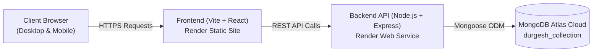

# Durgesh Collection (DP-Collection) — Client Handover & Testing Guide

**Project Name:** Durgesh Collection E-Commerce Web Application  
**Version:** 1.0.0 (Production Release)  
**Deployment Platform:** Render Cloud & MongoDB Atlas  

---

## 1. Project Overview & Live Links

This document provides complete instructions, live access links, feature breakdowns, and test cases for reviewing and testing the **Durgesh Collection** full-stack e-commerce system.

### 🔗 Live URLs

| Component | Service Type | Live URL | Status |
| :--- | :--- | :--- | :--- |
| **Frontend Storefront** | React + Vite SPA | [https://dp-collection-ui.onrender.com](https://dp-collection-ui.onrender.com) | 🟢 Live |
| **Backend REST API** | Node.js + Express | [https://dp-collection-h2g3.onrender.com/api](https://dp-collection-h2g3.onrender.com/api) | 🟢 Live |
| **Database** | MongoDB Atlas Cluster | `durgesh_collection` (Cloud Hosted) | 🟢 Connected |

> [!NOTE]
> **Free Tier Cold Start Notice:** Render free instances spin down after 15 minutes of inactivity. When opening the site after some idle time, the very first request may take **30–50 seconds** to wake up the backend. Subsequent requests will be fast.

---

## 2. Technology Stack

* **Frontend:** React 18, Vite, TailwindCSS / CSS Modules, Lucide Icons, Axios.
* **Backend:** Node.js, Express.js, CORS, Multer, Mongoose.
* **Database:** MongoDB Atlas (Multi-region Cloud Cluster).
* **Hosting & CI/CD:** Render Cloud with automated GitHub deployment pipeline.

---

## 3. Key Features Ready for Testing

### 🛍️ Customer Storefront
1. **Home & Banner Showcase:** Featured collections, seasonal highlights, and hero banners.
2. **Product Catalog:**
   * Grid display with high-resolution product images, titles, and pricing.
   * Category filtering and live keyword search.
   * Sorting by price (Low to High / High to Low), newest arrivals, and popularity.
3. **Product Detail Page (PDP):**
   * Multi-angle image preview / zoom.
   * Size and variant selection (S, M, L, XL, XXL).
   * Stock availability indicator and product descriptions.
4. **Interactive Shopping Cart:**
   * Add to cart / Remove from cart.
   * Real-time quantity increment/decrement with instant total calculation.
   * Persistent cart state across sessions.
5. **Checkout & Order Placement:**
   * Delivery address and contact details form.
   * Order summary and total calculation (Discounts, Delivery charges).
   * Order confirmation feedback.

### ⚙️ Admin & Management Capabilities
1. **Product Management:** Add new kurtis/dresses, update pricing, upload images, and set stock levels.
2. **Category & Tag Management:** Create and organize categories (e.g., Anarkali, Straight Kurti, Festive Wear).
3. **Order Tracking:** View received customer orders, shipping addresses, and status.

---

## 4. Step-by-Step QA & Client Testing Guide

Follow these sequential scenarios to thoroughly test the application flow:

### Test Case 1: Product Browsing & Search
| Step | Action | Expected Result |
| :--- | :--- | :--- |
| **1.1** | Open the [Frontend URL](https://dp-collection-ui.onrender.com). | Homepage loads with banner and product listings without visual glitches. |
| **1.2** | Click on any category filter (e.g., *Kurti Sets*, *Daily Wear*). | Product grid instantly filters to only show items in the selected category. |
| **1.3** | Type a search term in the search bar (e.g., *Cotton*, *Embroidered*). | Real-time search displays matching products matching title or tag. |
| **1.4** | Select sort option: *Price: Low to High*. | Products re-order correctly according to pricing. |

---

### Test Case 2: Product Details & Cart Workflow
| Step | Action | Expected Result |
| :--- | :--- | :--- |
| **2.1** | Click on any product card from the grid. | Navigates to the Product Detail Page showing full image, details, and price. |
| **2.2** | Select a size (e.g., `M` or `L`) and click **"Add to Cart"**. | Confirmation popup / notification appears; Cart badge counter increases by 1. |
| **2.3** | Open the Cart drawer/page. | The selected product, chosen size, and price appear accurately. |
| **2.4** | Increase item quantity using `+` button. | Subtotal and Total amount update dynamically. |
| **2.5** | Click remove button. | Item is removed and cart total resets to ₹0 or updates accordingly. |

---

### Test Case 3: Order Placement (End-to-End Flow)
| Step | Action | Expected Result |
| :--- | :--- | :--- |
| **3.1** | Add 1 or 2 products to cart and click **"Proceed to Checkout"**. | Checkout form opens requesting Name, Mobile Number, Email, and Shipping Address. |
| **3.2** | Fill in dummy/test delivery details and click **"Place Order"**. | Request is sent to backend API (`/api/orders`), order is saved in MongoDB. |
| **3.3** | Verify confirmation screen. | Success screen displays Order ID and summary. |

---

### Test Case 4: Mobile & Tablet Responsiveness
| Step | Action | Expected Result |
| :--- | :--- | :--- |
| **4.1** | Open the link on an Android / iPhone device or Chrome Mobile Inspector. | Navigation collapses into a responsive hamburger menu; touch sliders and buttons function smoothly. |

---

## 5. Backend API Endpoints Reference

If the client or their technical team needs to test API endpoints directly (via Postman / Browser):

| Method | Endpoint | Description |
| :--- | :--- | :--- |
| `GET` | `/api/products` | Fetches all available products with categories and pricing. |
| `GET` | `/api/products/:id` | Fetches single product details by ID. |
| `POST` | `/api/orders` | Submits a new customer order. |
| `GET` | `/api/categories` | Returns category taxonomy list. |
| `GET` | `/uploads/:filename` | Serves uploaded product image files. |

---

## 6. Recommendations & Next Steps for Production

> [!TIP]
> **Production Enhancements Checklist:**
> 1. **Custom Domain:** Connect your business domain (e.g., `https://durgeshcollection.com`) under Render *Settings → Custom Domains*.
> 2. **Online Payment Gateway:** Integrate **Razorpay** / **PhonePe** / **Cashfree** for instant UPI, Debit Card, and Netbanking payments.
> 3. **Cloud Image Hosting:** For storing hundreds of HD catalog images, plug in Cloudinary / AWS S3 to optimize loading speeds.
> 4. **WhatsApp Order Notification:** Integrate WhatsApp Business API to send automated order confirmation messages to customers.
